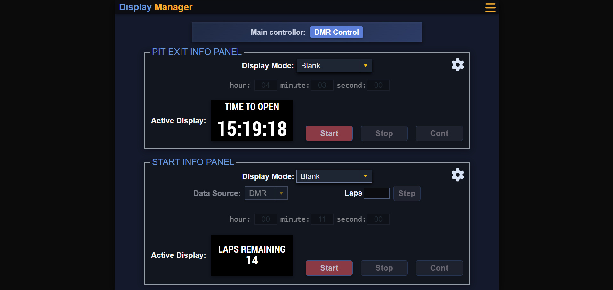
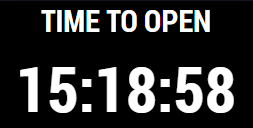
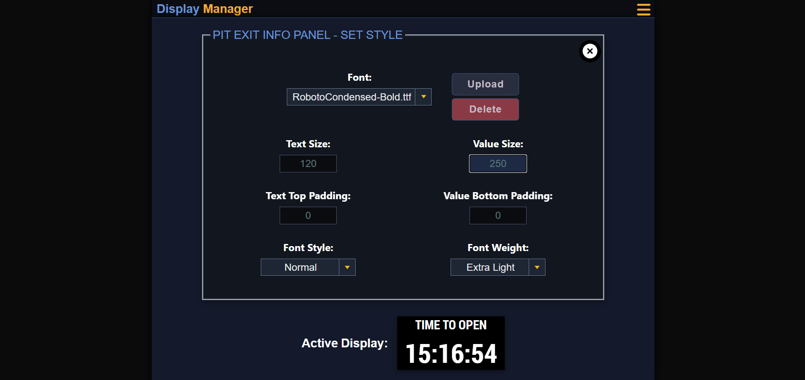
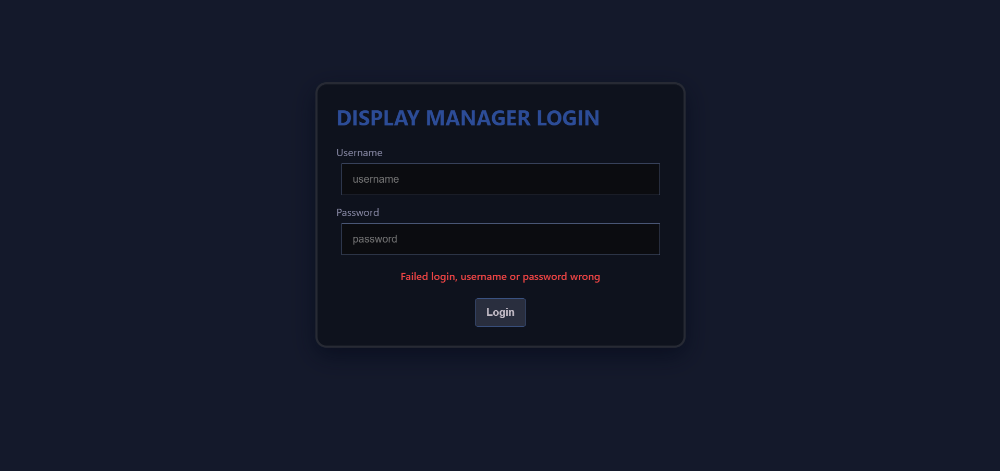
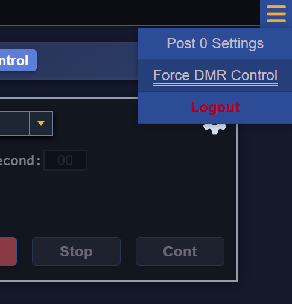
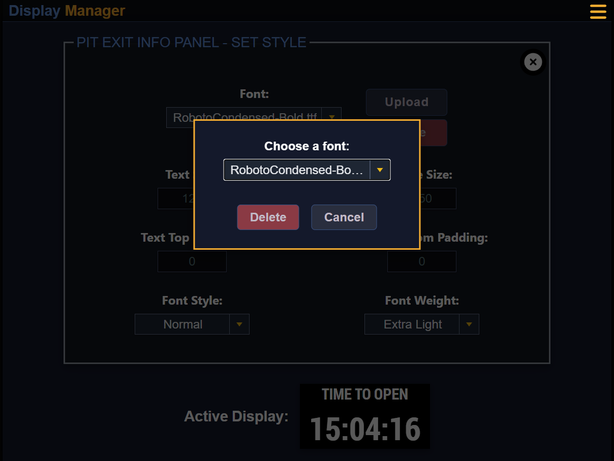
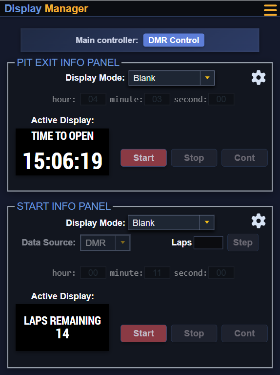
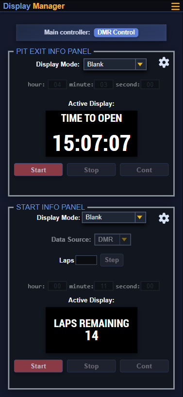

# Display Manager (DMR) - Frontend Showcase



## 🏁 Project Overview

This repository showcases the frontend of the real Display Manager (DMR), currently used at the Hungaroring race track. I was responsible for the frontend development of this project.

This application is a dashboard used to manage the physical LED displays around the track and control what is shown on them. It allows operators to adjust text properties (such as font size) and even upload new custom fonts.

**Technologies used:** Vanilla JavaScript, HTML5, CSS3.

**Display Panel:** The physical LED display located on the track at the Hungaroring.



## 📂 File Structure

Here is an overview of the frontend directory structure. To ensure maintainability, the codebase is organized into feature-based domains.

```text
├── auth/                 # Contains logic and styles specific to the login authentication page
├── core/                 # The backbone of the app (state management, WebSocket connection, global styles)
├── dashboard/            # Handles the main UI layout, user inputs, and live LED preview iframes
├── modals/               # Contains logic and styling for auxiliary pop-up windows (e.g., Post 0 settings)
├── settings_overlay/     # Logic for the visual configuration overlay (font uploads, sizes, paddings)
├── assets/               # Shared graphical assets like icons and images
├── index.html            # The main entry point and layout for the dashboard interface
├── login.html            # The login page interface
```


## ✨ Main Features

- **Real-Time Synchronization**
  - Maintains a persistent, two-way connection with the server using WebSockets.
  - Listens for backend events instead of polling to instantly update the dashboard.

- **Live Display Panel Previews**
  - Uses embedded iframes to render pixel-perfect live previews.
  - Displays exactly what will appear on the physical LED boards at the track.

- **Dynamic Styling for the Display Panels**
  - Adjust text sizes, weights, and paddings on the fly.
  - Upload custom font files (`.ttf`, `.otf`) and instantly apply them to the visual preview.

  

- **Secure Authentication**
  - Features a dedicated login interface.
  - Ensures only authorized personnel can access the control dashboard.

  


## 📸 Gallery








